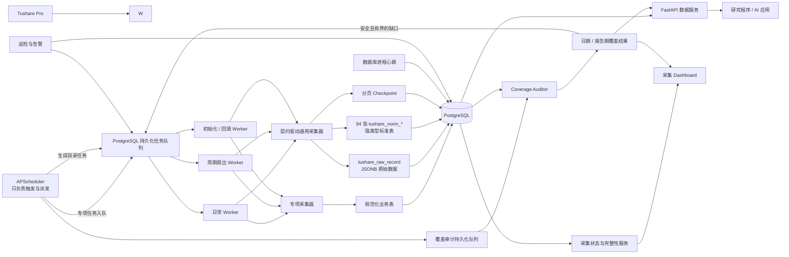
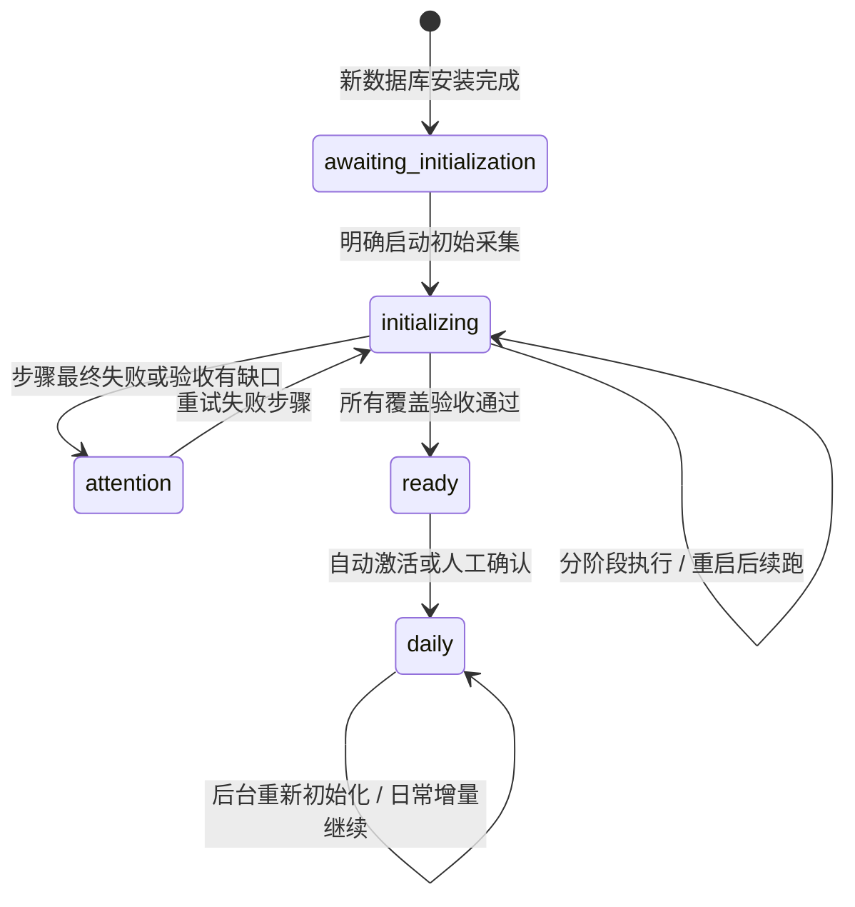

# claw-quant-data

面向量化研究的数据基础设施：从 Tushare Pro 稳定采集市场数据，保存到
PostgreSQL，并通过 REST API、Python 查询函数和采集 Dashboard 为上层研究、
策略与 AI 应用提供统一的数据入口。

它解决的核心问题不是“定时调用几个接口”，而是：

- 知道有哪些数据接口、当前 Token 能访问哪些接口；
- 按接口更新周期生成独立、可追踪的采集任务；
- 防止分页截断、重复写入、限频、网络异常和服务重启造成静默漏数；
- 能判断一次采集是完整、空结果、不完整、未验证还是失败；
- 让数据可以通过数据库、REST API 和 Dashboard 被查询和管理。

本项目负责数据采集、存储、质量状态和数据服务，**不包含选股策略、因子研究、
回测、组合管理或实盘交易**。

面向研究 Agent 的只读入口包括单数据集查询、股票快照和
`/api/v1/stocks/{ts_code}/research-pack`。Research Pack 只聚合带来源信息的原始
研究材料，并显式返回缺失项；其中 `major_news` 会按证券名称/代码做有界关键词
检索，交易所公告正文仍需官方外部来源补齐。预测、评级和操作建议仍属于上层 Agent。

## 先看结论

截至 2026-09-06，系统的实际建设状态如下：

| 项目 | 当前状态 |
|---|---:|
| Tushare 接口目录 | 244 个唯一 `api_name` |
| 当前 Token 可采集的只读接口 | 200 个 |
| 已实现接口 | 200 个（94 通用 + 106 专项/等价专项） |
| 实际采集器类 | 98 个（类数量不等于 API 数量） |
| 已进入自动编排 | 183 个 |
| 专项采集器编排 | 42 个 |
| 契约驱动通用采集编排 | 123 个 |
| 周期全量扇出编排 | 18 个 |
| 暂不安全自动运行 | 17 个 |
| 当前有正行数证据 | 183 个接口 |
| 当前无正行数证据 | 17 个接口（15 个需历史扇出/人工范围；`hk_daily` 首采等待接口窗口；`p_list` 未建用户组合时合法为空） |
| 数据服务物理表 | 192 张（97 张专项表 + 94 张契约标准表 + 1 张原始表） |
| REST API 白名单数据集 | 193 个，覆盖全部业务表并包含 `daily_basic` 业务别名视图 |
| 有明确 REST 数据路径的可采接口 | 200 个 |
| PostgreSQL `public` 表 | 213 张（含业务表、迁移表与 `sys_*` 运维表） |
| Docker 常驻服务 | PostgreSQL、自动备份、API、3 个隔离 Worker、Scheduler、Auditor 共 8 个 |
| 自动化测试 | 以当前 `pytest` 运行结果为准（同时覆盖单元与 PostgreSQL 契约测试） |

“已进入自动编排”表示系统会按周期生成任务，并不表示每个接口当前周期都一定有
数据。最终结果仍会根据完整性证据被判定为 `complete`、`empty`、
`incomplete` 等状态。

“当前有正行数证据”也不等于历史已经完整回填；它只说明原始表或对应规范化表
目前至少存在一行。逐接口动态证据见
[reports/tushare_data_presence.md](reports/tushare_data_presence.md)，统一采集器设计见
[docs/COLLECTOR_ARCHITECTURE.md](docs/COLLECTOR_ARCHITECTURE.md)。

最近一次真实数据库审计确认：当前核心日频窗口连续，但全历史初始化尚未执行完成；
采集时效、历史缺口和控制台真实失败口径见
[历史完整性、采集时效与告警真实性审计](reports/history_and_timeliness_audit_2026-09-06.md)。
2026-09-08 的共享 DNS 故障、漏报原因和治理验证见
[历史补采 DNS 故障复盘](reports/history_backfill_dns_incident_2026-09-08.md)。

### 为什么 200 个接口只有 98 个采集器类

接口、采集器类和物理表是三个不同口径，不能按数量一一对应：

- 94 个字段变化较大或使用频率较低的接口由一个参数化通用采集器承载；响应先写入
  `tushare_raw_record`，再进入94张强类型 `tushare_norm_*` 标准表；
- 106 个专项/等价专项接口契约复用 97 张领域规范化表，其中普通/VIP 接口可共用
  一套实现，`weekly`、`monthly` 等上游接口也可汇入同一张频率化行情表；
- `ggt_daily` 同时派生日表和月汇总表，所以一个上游接口也可能对应多张表；
- 因此采集入口仍是98个类，但数据服务层是97张专项表、94张通用接口标准表和
  1张原始表，共192张可查询数据表。

Dataset Registry 会从代码中的采集器契约和标准化契约生成完整安全白名单，并由
测试强制保证192张数据表全部可查询；数据库中其他 `sys_*` 运维表不会作为业务
数据公开。

通用标准化表采用“无损版本层 + 当前读视图”：`tushare_norm_*` 以完整 payload
哈希保存不同版本；经过官方输出契约复核的业务身份使用 `tushare_current_*`
选择最近版本供 REST 查询。身份字段不完整的记录不会被折叠，仍逐行返回。尚为
`heuristic` 的接口继续读取无损版本表，避免凭字段名猜业务主键。可重复审计结果见
[reports/normalized_identity_audit.md](reports/normalized_identity_audit.md)。

## 系统架构



七个常驻服务共同完成采集与查询：

| 服务 | 职责 |
|---|---|
| `postgres` | 保存业务数据、原始数据、任务队列、运行记录和 checkpoint |
| `scheduler` | 只生成专项、目录和覆盖审计任务，不在调度线程中执行上游采集 |
| `worker` | 仅领取日常专项、市场、财务和目录策略任务，保留关键增量执行槽 |
| `worker-fanout` | 仅领取安全周期扇出任务，处理大依赖宇宙的分片 |
| `worker-backfill` | 仅领取初始化和显式历史回填，不阻塞日常更新 |
| `auditor` | 独立计算日期和标的截面完整性，并为可信缺口生成有界补采任务 |
| `api` | 提供数据查询、任务管理、完整性总览、覆盖明细和 Dashboard |

## 从首次安装到日常更新

安装与初始采集被有意拆开。`install.sh` 负责数据库、迁移和七个常驻服务达到
健康状态；初始采集是一个可能持续数小时甚至数天的后台活动，不会阻塞安装脚本。

运行模式持久化在 PostgreSQL，不依赖某个进程的内存：



初始化只通过现有持久化队列生成任务，并按阶段推进：

1. 基础依赖：交易日历、股票/基金/可转债基础资料；
2. 核心历史：按交易日回填股票与全市场指数日线、每日基本面、资金流和涨跌停；
3. 财务历史：回填已过披露截止日的报告期，包含披露计划、快报、预告和主营构成；
4. 目录历史：宏观利率/账户统计按年分区，高数量转融通按月分区并分页穷尽；
5. 最新基线：为其余安全自动接口建立一次最新数据基线；
6. 全量扇出：对需要依赖宇宙的接口冻结清单并持久化分片执行；
7. 覆盖验收：用独立 Auditor 判断预期日期、报告期和标的截面是否完整。

任一步骤都是可审计、幂等且可重试的 `sys_collection_job` 或
`sys_data_coverage_job`。新数据库首次初始化期间，Scheduler 暂不创建日常专项、目录巡航和
日常覆盖任务，只有验收完成并切换到 `daily` 后才开始周期增量。已有系统发起重新初始化时
则保持 `daily`，历史任务由独立的 `worker-backfill` 执行，日、周、月、季度任务继续由
日常 Worker 处理，不会因为补历史而漏掉当天更新。

新数据库会进入 `awaiting_initialization`。已有任务或数据的升级实例会保持
`daily`，不会因为安装新版本突然停止原有调度。

## 一次数据采集是怎样完成的

系统有两条互补的采集路径。

### 1. 专项采集器

专项采集器位于 `collectors/stock/`、`collectors/index/`、`collectors/forex/`
和 `collectors/sge/`。它们了解具体接口字段，并将数据清洗后写入规范化业务表：

```text
Tushare → fetch → transform → 业务表 UPSERT
```

适合日线、交易日历、财务报表等已经有稳定业务模型的数据。数据库主键和
`ON CONFLICT` 保证重复采集不会产生重复记录。

### 2. 契约驱动通用采集器

`collectors/tushare_raw.py` 可以采集所有目录中已授权、只读的 Tushare 接口。
它以机器可读契约驱动同一个采集执行框架，但数据不会混在一张通用业务表中：
响应先无损保存到 `tushare_raw_record`，随后转换到该接口专属的
`tushare_norm_{api_name}` 强类型标准表：

```text
Tushare 接口契约 → 有界请求 / 分页 → JSONB 原始层 → 类型校验 → 接口专属标准表
```

每条记录使用 `api_name + request_hash + record_hash` 作为主键；`request_hash`
只描述业务查询范围，不包含 `limit` / `offset` 这类分页传输参数，因此改变页大小
或断点续跑不会为同一条记录制造另一份身份。标准表使用明确的日期、时间、数值和
文本类型，保留来源哈希、采集时间和契约版本；契约外字段进入 `_extra_payload` 并
登记 Schema Drift，转换失败记录进入隔离表，修复后可从原始层幂等重放。

通用任务不会依赖 Tushare SDK 的默认字段集合。任务创建时会把接口契约中的全部
输出字段固化到 `fields`，因此“分页完整”同时包含字段范围证据；手工缩小字段时，
服务会拒绝契约之外的字段并在任务参数中保留所选字段。

两者不是随机选择：任务创建时会固化 `handler_type`、`handler_key`、处理器版本和
代码版本。通用接口固定走“原始层 + 契约标准表”，专项/等价专项接口固定解析到
唯一的专项采集器并写入领域业务表；策略调度会排除已经由专项 cron 编排的接口，
避免同一周期被两套自动任务重复调用。无法唯一解析专项实现时任务会安全失败，
不会悄悄退化到通用存储。

## 什么叫“采集完成”

系统不会把“HTTP 请求没有报错”直接等同于“数据完整”。每个策略任务记录：

- 接口名、周期、期望日期和实际请求参数；
- 获取行数与实际新增行数；
- 分页页数、下一偏移量、页面哈希和是否真正耗尽；
- 重试次数、错误类型、开始时间和结束时间；
- 机器可读的 `completion_status` 与 `completion_evidence`。

状态含义：

| 状态 | 含义 |
|---|---|
| `pending` | 已生成周期任务，等待 Worker 执行 |
| `running` | 正在采集 |
| `retrying` | 临时错误或限频，等待退避重试 |
| `verifying` | 采集已成功写入，针对该日期/报告期的完整性审计正在排队或执行 |
| `complete` | 有界分区或分页耗尽得到证明，并且上游返回了数据 |
| `empty` | 请求完整执行且已穷尽，但上游返回 0 行；不等同于失败 |
| `incomplete` | 触及上限、疑似整数截断、分页重复或达到最大页数，不能证明完整 |
| `unverified` | 任务执行成功，但该专项采集器尚未提供足够完整性证据 |
| `failed` | 参数、权限或其他错误导致最终失败 |

关键规则：

- 支持 `limit` / `offset` 的接口必须逐页耗尽；
- 每页完成后保存 `sys_tushare_collection_checkpoint`，异常退出后可继续；
- 日期、月份、报告期和周接口必须使用有界分区；
- 返回官方上限或可疑的 1,000、3,000、5,000 等整数上限时，保守判为不完整；
- 通用和专项采集器共用上述分区与返回上限验证；专项实现不会再因为“返回行数
  大于零”直接得到 `complete`；
- 任意已出现页面再次出现都会立即停止，避免上游忽略或循环处理 `offset` 后死循环；
- 相同接口和业务请求范围只允许一个分页任务运行，防止并发 Worker 互相覆盖 checkpoint；
- 通用和专项采集的每次 SDK 请求都同时预留 Token 全局时间槽和接口时间槽；
- 参数和权限错误不盲目重试；临时网络错误按 60、300、900 秒指数退避，并同步
  暂停同一资源池的待执行任务，避免一次 DNS 故障批量耗尽历史任务的重试机会；
- 初始化进入 `attention` 后，只有全部失败步骤都带有可重试的网络、超时或配额
  证据时才会冷却后自动恢复，最多自动恢复 3 轮；完整性、权限和契约错误保持阻断；
- Worker 单任务默认 1,800 秒超时，避免网络调用永久占住进程。
- 每个运行任务持有短租约并周期续租；Worker 失联后，其他 Worker 会自动回收，
  耗尽尝试次数的任务进入最终失败状态；
- 任务在创建时固化采集器类型、逻辑处理器、处理器版本和代码版本。部署后如果
  路由发生不兼容变化，旧任务会安全失败，不会被静默交给另一个采集器；
- 队列负责完整任务重试。队列内运行时，采集器不再额外执行整套逻辑重试，避免
  `任务重试 × 采集器重试` 放大请求；HTTP transport 不执行隐藏 POST 重试，
  每一次真实重试都重新申请分布式限流额度并留下任务证据。

更详细的判定规则见
[Tushare 采集完整性与可靠性策略](docs/tushare/COLLECTION_RELIABILITY.md)。

## 自动调度与接口覆盖

### 三类自动任务

1. **专项 cron 任务**：处理交易日历、股票日线、指数、财务报表等 42 个接口，
   触发后同样先写入 `sys_collection_job`。
2. **策略目录任务**：根据接口契约推导日、周、月周期，为 119 个非专项接口生成独立
   的 `sys_collection_job`。
3. **周期全量扇出**：为 18 个已验证接口冻结实体宇宙，分批生成可恢复的
   日、周或月度活动。

策略调度使用 `Asia/Shanghai` 业务时区：

- 所有容器统一通过显式上海业务时钟计算交易日期，不依赖容器本地 UTC 时区；

- 07:15、09:15、13:15 的每日接口巡航采集最近已经完成的交易日；19:15、23:15
  直接采集当天交易日，让盘后发布的数据在当日完成，不推迟到下一交易日；
- 核心 A 股日线和 `bak_basic` 在交易日 16:00 首采，并在 19:00、23:00
  对当天分区做幂等重采；即使上游首轮延迟或返回空集，也不会等到次日才补；
- 每周接口采集上一个完整周；
- 每月接口按上一个完整月生成有界参数；
- 调度器在启动后立即补一次，并在每天 07:15、09:15、13:15、19:15、23:15
  做幂等巡航；
- 同一接口、同一周期、同一参数使用幂等键，只会生成一份任务。
- 如果该任务成功但返回 `empty`，后续巡航会按日/周/月/季度的不同发布窗口，生成
  有间隔、有次数上限且单独留痕的 recheck 任务；不会覆盖原任务，也不会密集轮询；
- 专项 cron 的最后派发时间写入 `sys_collection_schedule_cursor`。Scheduler 每分钟
  对账一次，重启后会在有界窗口内按日期逐日补发；同一天有多个重试时点只保留
  最后一次，周末触发不会掩盖周五漏采。补发仍经过
  `sys_collection_job`，不会在调度线程内直接访问 Tushare。旧版本留下的
  `last_job_id=NULL` 引导游标会被视为“尚无采集证据”并自动补发，而不是跳过。

### 为什么还有 17 个接口不自动跑

| 原因 | 数量 | 处理方式 |
|---|---:|---|
| 初始化基线覆盖、暂不做周期高基数扇出 | 13 | 需要时通过受控活动运行，避免日常额度失控 |
| `ccass_hold_detail` 单日规模不可控 | 1 | 必须显式限定股票或日期范围 |
| `fund_basic` 业务范围需人工指定 | 1 | 初始化按已验证的 E/O 范围采集 |
| `stk_mins` 极低频限流 | 1 | 保持按需，避免小时配额被无界扇出耗尽 |
| `p_get` 依赖调用方名称清单 | 1 | 仅接受显式依赖清单 |

这 17 个接口不是“没有实现”，而是不适合按固定周期直接全量调用。其中仍有一部分
可以使用**受控按需扇出**：调用方必须给出日期或报告期边界，单批最多 200 个
子任务，股票、基金、转债和指数清单只从白名单本地表读取；剩余接口仍保持人工
显式调用或禁用批量回填。

受控扇出先创建一条 `job_kind=batch` 父任务，再在同一事务中创建可独立租约、
重试和审计的 `job_kind=leaf` 子任务。父任务不被 Worker 执行，其状态和行数由
PostgreSQL 触发器根据子任务实时汇总。进程重启不会丢失批次进度，失败子任务可
原地重新入队，也不会因为另建“孙任务”造成批次计数失真。

需要覆盖整个依赖宇宙时，使用持久化 `fanout campaign`。活动会把首个分页看到的
完整有序实体清单保存到 `sys_collection_fanout_campaign_entity`，同时固化来源、
总数和 SHA-256 摘要；Scheduler 只在上一页所有子任务均成功并有 `verified=true`
完整性证据后生成下一页。活动运行期间的上市、退市或分类变化由下一周期的新活动
接收，不会把两个宇宙拼在一起，也不会让长任务因清单正常变化而中断。
`full` 初始化会在独立的“全量扇出”阶段自动执行 19 类安全基线：其中 17 类冻结
实体宇宙后安全扇出，`fund_nav`/`fund_portfolio` 改用全市场日期/报告期分页；除转债利率/
评级、期货合约、中信/申万行业成分和全股票质押统计外，还覆盖基金净值/持仓，
以及必须按本地冻结实体宇宙拆分的筹码、股东、审计意见、指数权重与周月频复权数据。
带日期窗口的接口严格受各自最大窗口约束；事件型基线允许经过完整宇宙验证的空结果，
但不会把零行直接当成成功。

完整的接口权限、契约、示例和代码索引见
[docs/tushare/README.md](docs/tushare/README.md)。

## 数据如何存储

数据库分为三层。

### 规范化业务表

例如：

- `stock_basic`、`daily`、`bak_basic`、`moneyflow`；
- `income`、`balancesheet`、`cashflow`、`fina_indicator`；
- `index_daily`、`ths_daily`、`fx_daily`、`sge_daily`。

适合 SQL、REST API、因子计算和上层研究使用。

### 通用接口标准表与原始审计层

每个通用接口都有独立的 `tushare_norm_{api_name}` 标准表。业务字段和 PostgreSQL
类型由接口契约生成；表内同时保存 `_record_hash`、`_request_hash`、上游文档编号、
源采集时间、首次/最近观测时间、契约版本和契约外字段。REST 数据服务默认只查询
这些标准表，不从 JSONB 动态解释业务字段。

`tushare_raw_record` 保存：

- `api_name`；
- 原始请求参数及请求哈希；
- 单条返回记录 JSONB 及记录哈希；
- 采集时间。

它是可审计、可重放的原始证据层，不作为通用接口的默认业务查询模型。

### 系统运行表

| 表 | 用途 |
|---|---|
| `sys_collection_job` | 每接口、每周期的持久化任务与完成证据 |
| `sys_collection_fanout_campaign` | 全依赖宇宙扇出活动、周期身份、计划版本与严格分页进度 |
| `sys_collection_schedule_cursor` | 专项 cron 的持久化派发游标，用于停机补发 |
| `sys_tushare_collection_checkpoint` | offset 分页断点和累计行数 |
| `sys_collector_run` | 专项调度器运行历史 |
| `sys_service_heartbeat` | Scheduler、Worker、Auditor 的真实进程心跳 |
| `sys_tushare_rate_limit` | 多 Worker 共享的上游请求时间槽 |
| `sys_schema_migration` | 数据库迁移版本和 SHA-256 校验和 |
| `sys_config` | 兼容旧部署的系统配置 |

### 日期与报告期覆盖审计

覆盖审计独立于采集任务运行状态。Scheduler 每天只生成有界审计任务，单独的
Auditor 进程比较“应有分区”和业务表中的“实际分区”，结果写入：

| 表 | 用途 |
|---|---|
| `sys_data_coverage_job` | 独立覆盖审计队列，不阻塞采集 Worker |
| `sys_data_coverage_audit` | 一次有界审计的区间、覆盖率和证据 |
| `sys_data_coverage_partition` | 每个日期或报告期最新的存在、缺失状态和数据量 |

对已有可靠覆盖规则的规范化采集，Worker 会在“业务写入成功”的同一数据库事务中
生成一条关联审计任务，并先把原任务置为 `verifying`。Auditor 完成后再把原任务
改为 `complete`、`empty`、`incomplete` 或 `unverified`；如果发现明确的
`missing` / `partial` 分区，会继续生成有界、幂等的补采任务。这样进程在写入和
提交审计之间崩溃，也不会留下虚假的“已完成”状态。

A 股日、周、月数据使用 `trade_cal` 生成预期日期；财务数据只有在法定披露截止日
后才把报告期纳入预期。外汇、SGE 和停复牌等没有可靠专属日历或属于事件型的
数据只展示实际存在日期，不推断缺失，避免假告警。

全部193个 REST 数据集都进入覆盖分类：有可靠交易日/报告期规则的标为
`expected_partitions`，有日期但无可靠预期日历的标为 `observed_partitions`，无日期
分区的标为 `not_applicable`。每天自动审计仍只运行49条已验证规则；其他日期型
数据集可按名称手动提交审计，但只列出现有日期，绝不臆造缺口。

系统同时保存 `row_count`、去重后的 `entity_count`、按日期推导的
`expected_entity_count` 和截面覆盖率。参考标的池可用且低于安全阈值时，分区会
标记为 `partial`；参考池为空时不会猜测，仍保守保留日期级结果。
对已经建立无歧义日期/报告期参数映射的数据集，Auditor 会把 `missing` 或 `partial`
分区限量提交到采集队列；指数周期和两融等通用接口使用全市场日期分区及 offset
穷尽做安全修复；
其他数据集只报告问题，不制造不可信补采参数。
如果 `trade_cal` 没有完整覆盖审计区间（包括区间内部日历缺口），市场数据审计
会标记为 `unverified`，不会低估应有交易日后错误报告“日期齐全”。

## 如何使用系统

### 采集 Dashboard

安装后打开：

- [http://127.0.0.1:8000/dashboard](http://127.0.0.1:8000/dashboard)

Dashboard 可以：

- 通过“运行总览 / 接口任务 / 扇出活动 / 覆盖审计”四个页签按职责查看，避免所有模块同时铺开；
- 在“数据缺失与可信度”区域统一查看真实缺失、空表、未首采和完整性未知；
- 将“已确认问题”和“尚未证明完整”分开统计，未知状态不会冒充采集失败；
- 只把已纳入周期规则但尚无审计的数据集列为待处理；按需观察数据不制造伪故障；
- 将没有固定发布间隔的公告/事件数据标为“按事件更新”，不会因近期无事件误报过期；
- 合并接口名与 REST 数据集别名的同源问题，并区分“等待初始化首采”和“缺少采集方案”；
- 启动、暂停、续跑和查看一次可恢复的初始采集活动；
- 同时显示初始化总目标、当前阶段已生成日期范围、正在运行/排队的日期范围和数据集；
- 查看 244 个接口的权限、编排方式、周期和最近完成状态；
- 按接口名、周期、状态和编排方式筛选；
- 接口、健康问题、扇出活动、覆盖数据集，以及弹窗中的初始化步骤、子任务和日期明细均分页展示；筛选后自动返回第一页；
- 查看获取行数、写入行数和完成判定原因；
- 分开查看“历史补采”和“日常扇出”的活动与排队数量，避免将例行任务误认为初始化仍未结束；
- 对失败任务执行重试；
- 幂等生成最近日、周、月和季度补采任务。
- 查看各数据集有哪些日期、缺哪些日期以及每天的行数和标的数；
- 在日期明细中按起止日期和“缺失 / 截面不完整”状态筛选；
- 指定数据集和最长 10 年的日期范围，二次确认后先审计，再只为已确认缺口生成幂等补采任务。

查看无需密钥。“立即补采”和“重试”会在页面中二次确认。服务默认只发布到
`127.0.0.1`；如果改成局域网或公网访问，必须在网络边界重新增加认证。

### REST 数据服务

当前 Dataset Registry 对外开放全部192个数据集。专项数据和通用接口强类型标准
数据均按数据集查询；原始 JSONB 只承担审计和重放：

```bash
curl http://127.0.0.1:8000/api/v1/datasets

curl 'http://127.0.0.1:8000/api/v1/datasets/stock_daily/records?ts_code=000001.SZ&limit=20'

curl http://127.0.0.1:8000/api/v1/interfaces

curl 'http://127.0.0.1:8000/api/v1/interfaces/adj_factor/records?ts_code=000001.SZ&start_date=2026-01-01&limit=20'

curl http://127.0.0.1:8000/api/v1/stocks/000001.SZ/snapshot
```

日期参数同时支持 `YYYY-MM-DD` 和 `YYYYMMDD`。通用查询默认返回 100 行，
单次最多 1,000 行。规范化表只允许 Dataset Registry 声明的过滤字段；JSONB
查询只允许该 Tushare 接口输出契约声明的字段，字段名不会直接拼接到 SQL。

主要接口：

| 接口 | 用途 |
|---|---|
| `GET /api/health/live` | 进程存活检查 |
| `GET /api/health/ready` | PostgreSQL 就绪检查 |
| `GET /api/v1/datasets` | 数据集发现 |
| `GET /api/v1/datasets/{name}` | 字段、过滤器和主键信息 |
| `GET /api/v1/datasets/{name}/records` | 数据查询与分页 |
| `GET /api/v1/interfaces` | 发现 200 个可采接口及其数据集/原始数据路径 |
| `GET /api/v1/interfaces/{api_name}` | 查询接口契约、文档、字段和允许过滤器 |
| `GET /api/v1/interfaces/{api_name}/records` | 查询通用接口的强类型标准数据 |
| `GET /api/v1/normalization` | 查看94个通用接口的标准化健康状态 |
| `GET /api/v1/normalization/drift` | 查看字段新增、缺失等 Schema Drift |
| `GET /api/v1/normalization/errors` | 查看未解决或历史隔离记录 |
| `GET /api/v1/freshness` | 数据最新日期和新鲜度 |
| `GET /api/v1/stocks/{ts_code}/snapshot` | 股票综合快照 |
| `GET /api/v1/collection-tasks` | 可提交的任务类型 |
| `POST /api/v1/collection-jobs` | 提交持久化采集任务 |
| `GET /api/v1/collection-jobs` | 按接口、周期和状态查询任务历史 |
| `POST /api/v1/collection-jobs/{id}/retry` | 重试失败任务 |
| `GET /api/v1/collection-batches/fanout-definitions` | 查询允许安全扇出的接口、依赖和边界 |
| `POST /api/v1/collection-batches/fanout` | 创建有界、持久化父子回填批次 |
| `GET /api/v1/collection-fanout-campaigns` | 查询跨分页全量扇出活动及已验证进度 |
| `GET /api/v1/collection-fanout-schedules` | 查询已启用的日/周/月安全扇出配方 |
| `POST /api/v1/collection-fanout-campaigns` | 创建自动续页的全量扇出活动 |
| `GET /api/v1/collection-fanout-campaigns/{id}` | 查询活动与每个父子批次的完整证据 |
| `POST /api/v1/collection-fanout-campaigns/{id}/pause` | 暂停生成后续分页（不强杀运行中子任务） |
| `POST /api/v1/collection-fanout-campaigns/{id}/resume` | 重排失败子任务并继续活动 |
| `GET /api/v1/collection-overview` | 全接口采集状态与完成证据 |
| `GET /api/v1/data-health` | 统一数据健康视图：缺失、时效、完整性证据和历史初始化状态 |
| `POST /api/v1/collection-dispatch` | 生成最近周期补采任务 |
| `GET /api/v1/coverage` | 数据集日期覆盖总览和最近缺失日期 |
| `GET /api/v1/coverage/datasets/{name}/partitions` | 按日期及状态查询分区明细；`status=problem` 同时返回缺失和不完整分区 |
| `POST /api/v1/coverage/audits` | 异步提交有界覆盖审计 |
| `POST /api/v1/coverage/repairs` | 为指定范围内已经审计确认的安全缺口生成幂等补采任务 |
| `GET /api/v1/coverage/jobs` | 查看覆盖审计队列 |
| `GET /api/v1/initialization` | 查询运行模式、当前和最近一次初始化活动 |
| `POST /api/v1/initialization` | 创建一次分阶段、可恢复的初始采集 |
| `GET /api/v1/initialization/{id}/steps` | 查看每个初始化步骤及其采集/审计任务 |
| `POST /api/v1/initialization/{id}/pause` | 暂停初始化协调（不强杀已运行任务） |
| `POST /api/v1/initialization/{id}/resume` | 续跑并用新幂等轮次重建失败步骤 |
| `POST /api/v1/initialization/{id}/activate` | 验收完成后切换到日常增量模式 |

Swagger UI：<http://127.0.0.1:8000/api/docs>

### `clawq` CLI

仓库根目录提供面向个人和 Agent 的只读命令行入口。CLI 只使用 Python 标准库，
无需在宿主机安装项目依赖；默认连接本机的 `/api` 服务：

```bash
./clawq health
./clawq status
./clawq datasets list --category market
./clawq --pretty datasets describe stock_daily

./clawq query stock_daily \
  --filter ts_code=000001.SZ \
  --start-date 2026-01-01 \
  --limit 20

./clawq stock snapshot 000001.SZ
./clawq freshness stock_daily
./clawq coverage show stock_daily --status missing
./clawq interfaces describe adj_factor
```

全局参数必须放在子命令之前。例如：

```bash
./clawq --pretty datasets describe stock_daily
./clawq --output csv query stock_daily --limit 20
./clawq --output jsonl interfaces query adj_factor --limit 20
```

默认输出稳定的单行 JSON；`--pretty` 用于人工阅读，`--output jsonl|csv` 用于
行式处理。错误只写入 `stderr`，并返回机器可读的 `error.code` 和稳定退出码。
CLI 默认没有任何写命令，Agent 无法通过它创建、重试或删除采集任务。

完整命令、配置和输出契约见 [Agent 与命令行访问说明](docs/CLI.md)。

### Agent Skill

仓库内置 `.agents/skills/claw-quant-data`，Codex 从仓库目录工作时会自动发现。
也可以显式调用 `$claw-quant-data`。Skill 要求 Agent 在给出数据结论前依次检查
服务健康度、相关数据集契约、新鲜度和覆盖证据，并明确区分“确认缺失”和“尚未
审计”；它只复用只读 `clawq`，不会绕过控制台的管理确认流程。

### Python 查询函数

`service/tools/` 保留了按股票、财务、指数、资金流、板块、外汇和黄金等领域
组织的 Python 查询函数，适合在同一 Python 环境中的研究代码直接调用。

## 快速开始

### 一键安装（推荐）

要求已安装并启动 Docker Desktop：

```bash
chmod +x install.sh
./install.sh
```

脚本会自动：

- 检查 Docker 与 Docker Compose；
- 创建或保留 `.env`，生成随机数据库密码并提示输入 Tushare Token；
- 构建镜像并启动 PostgreSQL、API、Worker 和 Scheduler；
- 升级旧数据卷前自动备份；
- 执行校验和保护的版本化迁移；
- 验证数据库、API、Dashboard、Token 和调度器状态。

无人值守安装：

```bash
TUSHARE_TOKEN='your-token' ./install.sh --non-interactive
```

脚本可安全重复执行，不会删除 PostgreSQL 数据卷。

首次安装完成后，打开 Dashboard 的“初始采集”区域选择范围并确认启动：

- `快速`：最近 30 天，只建立核心行情验证环境；
- `标准`：最近 1 年，推荐默认范围；
- `研究`：最近 3 年，任务量、存储和耗时显著增加。
- `全部历史`：从 1990-12-19 起，按数据集可靠起点回填全部可验证历史。

“全部历史”不表示把每个接口从 1990 年开始盲目按天调用。核心股票和指数日线
按交易日回填，其中指数使用全市场 offset 穷尽；资金流依据[官方契约](https://tushare.pro/document/2?doc_id=170)
从 2010 年开始；涨跌停从价格限制制度可用期开始；财务数据按已发布报告期回填。
宏观利率和账户统计按年窗口，转融通按月窗口回填；LIBOR 显式遍历
USD/EUR/JPY/GBP/CHF，避免把默认 USD 误当全部币种。事件、名单和快照型接口
没有连续历史分区语义，因此仍采集最新完整基线。每次协调
最多新建 500 个步骤；当前批次全部完成或明确失败后，Scheduler 才规划下一批，
避免一次生成数万任务阻塞数据库，也避免第一个迟到的失败结果让仍在执行的整批任务
过早进入人工关注。该档位通常会持续数小时到数天，且显著增加 API 调用量和存储占用。

早期 A 股存在 `daily_basic` 有记录但 `daily` 当日无成交行的上游语义差异。系统仍
完整保存每个历史交易日可取得的响应，并逐日校验有界请求未触顶；对于核心行情，
最终阶段再对最近 120 天执行严格上市证券截面验收。历史传输完整性与当前发布完整性
分别证明，避免将不可证明的早期截面误报为采集器故障。

也可以通过 REST 启动；请求立即返回，采集在后台继续：

```bash
curl -X POST http://127.0.0.1:8000/api/v1/initialization \
  -H 'Content-Type: application/json' \
  -H "Idempotency-Key: first-initialization-$(date +%s)" \
  -d '{"profile":"standard","auto_activate":true}'

curl http://127.0.0.1:8000/api/v1/initialization
```

`auto_activate=false` 会在覆盖验收通过后停留在 `ready`，等待控制台二次确认；
默认值为 `true`，验收通过后自动进入日常增量模式。

安装完成后：

| 入口 | 地址 |
|---|---|
| Dashboard | <http://127.0.0.1:8000/dashboard> |
| REST API | <http://127.0.0.1:8000> |
| Swagger | <http://127.0.0.1:8000/api/docs> |
| PostgreSQL | `127.0.0.1:5432` |

### 手动 Docker Compose

```bash
cp .env.example .env
# 编辑 DB_PASSWORD 和 TUSHARE_TOKEN
docker compose up -d --build
docker compose ps
```

首次创建数据卷时 PostgreSQL 会运行 `sql/init_*.sql`；每次 `docker compose up`
还会先执行一次性 `migrate` 服务，因此已有数据卷会自动通过校验和迁移升级。

### 不使用 Docker

要求 Python 3.11 和 PostgreSQL 14 以上版本：

```bash
python3.11 -m venv .venv
source .venv/bin/activate
pip install -r requirements-dev.txt
cp .env.example .env
```

初始化数据库：

```bash
for file in sql/init_*.sql; do
  psql -h "$DB_HOST" -U "$DB_USER" -d "$DB_NAME" -f "$file"
done
python scripts/migrate.py
```

分别启动：

```bash
uvicorn service.api.app:app --host 127.0.0.1 --port 8000
python -m service.collection_jobs.worker
python -m service.data_coverage.worker
python collectors/scheduler.py
```

## 常见操作

### 提交专项采集任务

```bash
curl -X POST http://127.0.0.1:8000/api/v1/collection-jobs \
  -H 'Content-Type: application/json' \
  -H 'Idempotency-Key: daily-000001-20260725' \
  -d '{
    "task_name": "stock_daily",
    "parameters": {
      "trade_date": "2026-07-25",
      "ts_code": "000001.SZ"
    },
    "max_attempts": 3
  }'
```

### 提交通用 Tushare 接口任务

```bash
curl -X POST http://127.0.0.1:8000/api/v1/collection-jobs \
  -H 'Content-Type: application/json' \
  -H 'Idempotency-Key: cn-cpi-202601-202606' \
  -d '{
    "task_name": "tushare_interface",
    "parameters": {
      "api_name": "cn_cpi",
      "parameters": {"start_m": "202601", "end_m": "202606"},
      "complete": true,
      "resume": true
    }
  }'
```

`complete=true` 默认启用完整性保护；不要在生产补数中关闭。`Idempotency-Key`
用于防止客户端重试时重复创建任务。手工任务默认最多尝试 3 次；无权限、参数错误
等永久错误不会因为该配置而盲目重试。

### 查询某个接口的任务历史

```bash
curl 'http://127.0.0.1:8000/api/v1/collection-jobs?api_name=cn_cpi&limit=20'
```

### 创建受控扇出回填批次

```bash
curl -X POST http://127.0.0.1:8000/api/v1/collection-batches/fanout \
  -H 'Content-Type: application/json' \
  -H 'Idempotency-Key: cyq-chips-20260828-page-0' \
  -d '{
    "api_name": "cyq_chips",
    "start_date": "2026-08-28",
    "end_date": "2026-08-28",
    "offset": 0,
    "max_children": 50
  }'
```

响应是一条父批次任务。使用
`GET /api/v1/collection-jobs?parent_job_id={job_id}` 查询子任务；下一批从响应
`completion_evidence.plan.next_offset` 继续。日期窗口、报告期、枚举、最大子任务
数和依赖来源均由服务端白名单约束，不能通过请求指定表名或任意扇出参数。

### 创建自动续页的全量扇出活动

```bash
curl -X POST http://127.0.0.1:8000/api/v1/collection-fanout-campaigns \
  -H 'Content-Type: application/json' \
  -H "Idempotency-Key: pledge-stat-full-$(date +%s)" \
  -d '{"api_name":"pledge_stat","page_size":200}'

curl http://127.0.0.1:8000/api/v1/collection-fanout-campaigns/1
```

`page_size` 是每个父批次允许的最大子任务数，范围为 1–200。活动的
`completed_offset` 只随已严格验证的分页前进；`next_offset` 表示已经规划到的
位置，两者分开保存以支持崩溃恢复。可在同一控制台查看活动、分页和叶子任务，
并执行带二次确认的暂停或继续操作。

系统当前自动派发 8 个低风险配方：`dc_index`、`cb_share` 为每日有界分区，
`cb_rate`、`cb_rating`、`ci_index_member`、`index_member_all`、`fut_basic`
为每周完整快照，`pledge_stat` 为低优先级月度全股票快照。每日高基数筹码、基金
净值和指数历史等接口仍只允许显式活动；它们进入独立回填池，不会占用日常 Worker。

### 查询与重新审计日期覆盖

```bash
curl http://127.0.0.1:8000/api/v1/coverage

curl 'http://127.0.0.1:8000/api/v1/coverage/datasets/stock_daily/partitions?status=missing&limit=100'

curl -X POST http://127.0.0.1:8000/api/v1/coverage/audits \
  -H 'Content-Type: application/json' \
  -H "Idempotency-Key: manual-coverage-$(date +%s)" \
  -d '{"datasets":["stock_daily"],"start_date":"2026-01-01","end_date":"2026-08-28"}'
```

### 命令行预览接口

```bash
python scripts/collect_tushare_interface.py --list
python scripts/collect_tushare_interface.py cn_cpi \
  --param start_m=202601 --param end_m=202606 --dry-run
```

### 查看服务和日志

```bash
docker compose ps
docker compose logs -f worker
docker compose logs -f worker-fanout
docker compose logs -f worker-backfill
docker compose logs -f scheduler
docker compose logs -f auditor
curl http://127.0.0.1:8000/api/health/ready
```

### 查看队列和 checkpoint

```sql
SELECT api_name, period_key, status, completion_status,
       rows_fetched, rows_inserted, finished_at
FROM sys_collection_job
ORDER BY created_at DESC
LIMIT 50;

SELECT api_name, status, next_offset, pages_completed,
       rows_fetched, rows_stored, last_error
FROM sys_tushare_collection_checkpoint
ORDER BY updated_at DESC
LIMIT 50;
```

### 备份与恢复

```bash
./scripts/backup.sh
./scripts/restore.sh backups/claw-quant-YYYYMMDD-HHMMSS.dump --yes
```

恢复会覆盖当前数据库对象，脚本会先停止 API、三个 Worker、Auditor 和 Scheduler。

### 停止服务

```bash
docker compose down
```

不要使用 `docker compose down -v`，除非明确希望删除 PostgreSQL 数据卷。

## 配置项

核心配置均在 `.env`：

| 配置 | 默认值 | 说明 |
|---|---|---|
| `DB_HOST` | `127.0.0.1` | 本机运行时数据库地址；容器内自动使用 `postgres` |
| `DB_PORT` | `5432` | PostgreSQL 端口 |
| `DB_NAME` | `tushare_db` | 数据库名 |
| `DB_USER` | `tushare` | 数据库用户 |
| `DB_PASSWORD` | 无 | 必须设置强密码 |
| `TUSHARE_TOKEN` | 无 | Tushare Pro Token |
| `TUSHARE_GLOBAL_MIN_INTERVAL_SECONDS` | `0.5` | 所有进程共享的 Token 级最小请求间隔；接口自身更慢的限制仍会同时生效 |
| `TUSHARE_CONNECT_TIMEOUT_SECONDS` | `5` | Tushare 建连超时；Docker 路由或 DNS 故障可快速进入持久化重试 |
| `TUSHARE_READ_TIMEOUT_SECONDS` | `60` | 已连接请求的响应读取超时，兼顾大页接口 |
| `API_BIND_HOST` | `127.0.0.1` | Docker 发布地址，保持本机绑定时无需 API 鉴权 |
| `API_PORT` | `8000` | API 和 Dashboard 端口 |
| `API_DB_POOL_MIN` | `1` | API 最小数据库连接数 |
| `API_DB_POOL_MAX` | `10` | API 最大数据库连接数 |
| `JOB_POLL_INTERVAL_SECONDS` | `2` | Worker 空闲轮询间隔 |
| `JOB_STALE_AFTER_SECONDS` | `21600` | 兼容旧任务无租约时的失联回收阈值 |
| `JOB_EXECUTION_TIMEOUT_SECONDS` | `1800` | 单任务执行超时 |
| `JOB_LEASE_SECONDS` | `120` | 运行任务租约时长；Worker 在执行期间自动续租 |
| `JOB_RECLAIM_INTERVAL_SECONDS` | `60` | Worker 与 Auditor 周期回收失联任务的间隔 |
| `JOB_NETWORK_RETRY_BASE_SECONDS` | `60` | 网络故障首次退避秒数，后续按 5 倍增长 |
| `JOB_NETWORK_RETRY_MAX_SECONDS` | `900` | 网络故障单次退避与同资源池暂停的上限 |
| `INITIALIZATION_AUTO_RECOVERY_COOLDOWN_SECONDS` | `300` | 初始化仅对可重试瞬态故障自动恢复前的冷却时间 |
| `INITIALIZATION_AUTO_RECOVERY_MAX_ROUNDS` | `3` | 单次初始化最多自动恢复的瞬态故障轮数，与人工验收轮次独立 |
| `ROUTINE_WORKER_RESOURCE_CLASSES` | `scheduled,generic,reference,market,moneyflow,finance,catalog,default` | 日常 Worker 允许领取的资源类别 |
| `FANOUT_WORKER_RESOURCE_CLASSES` | `fanout` | 周期扇出 Worker 允许领取的资源类别 |
| `BACKFILL_WORKER_RESOURCE_CLASSES` | `initialization,backfill` | 初始化/回填 Worker 允许领取的资源类别 |
| `SCHEDULE_RECONCILE_LOOKBACK_DAYS` | `8` | 专项计划停机补发的最大回看天数 |
| `APP_REVISION` | `0.1.0` | 写入任务记录的镜像、Git SHA 或发布版本标识 |
| `COVERAGE_POLL_INTERVAL_SECONDS` | `5` | Auditor 空闲轮询间隔 |
| `COVERAGE_STALE_AFTER_SECONDS` | `3600` | Auditor 回收遗留审计任务的阈值 |
| `COVERAGE_AUTO_REPAIR_ENABLED` | `true` | 是否为明确安全的缺失/不完整分区生成补采任务 |
| `COVERAGE_AUTO_REPAIR_LIMIT` | `10` | 单数据集、单次审计最多生成的补采任务数 |
| `SERVICE_HEARTBEAT_MAX_AGE_SECONDS` | `90` | 非 HTTP 服务心跳最大允许延迟 |
| `NOTIFIER_TYPE` | `log` | `log` 或 `dingtalk` |
| `BACKUP_INTERVAL_SECONDS` | `86400` | PostgreSQL 自动备份周期；由独立 `backup` 容器执行 |
| `BACKUP_RETENTION_DAYS` | `14` | 自动备份保留天数，过期文件会在成功备份后清理 |

为兼容旧部署，Token 也可以保存在数据库：

```sql
INSERT INTO sys_config (cfg_key, cfg_value, description)
VALUES ('tushare.token', 'your-token', 'Tushare Pro token')
ON CONFLICT (cfg_key) DO UPDATE SET cfg_value = EXCLUDED.cfg_value;
```

## 项目目录

```text
claw-quant-data/
├── .agents/skills/             # 随仓库分发的 Agent 数据查询 Skill
├── collectors/                 # 专项采集器、通用采集器和 APScheduler
│   ├── stock/                  # A股基础、行情、财务、资金流、参考数据
│   ├── index/                  # 指数与行业数据
│   ├── forex/                  # 外汇数据
│   ├── sge/                    # 上海黄金交易所数据
│   ├── base.py                 # 重试、错误分类、通用 UPSERT
│   ├── tushare_raw.py          # 契约通用采集、原始落地、标准化与分页 checkpoint
│   └── scheduler.py            # 周期任务与巡检
├── service/
│   ├── api/                    # FastAPI 路由与响应契约
│   ├── collection_jobs/        # 持久化队列、任务注册表和 Worker
│   ├── data_coverage/          # 覆盖规则、审计服务、持久化和 Auditor
│   ├── data_service/           # Dataset Registry 和查询服务
│   ├── initialization/         # 首次回填状态机、阶段计划和运行模式门控
│   ├── cli/                    # 零额外依赖的只读 Agent/命令行客户端
│   ├── dashboard/              # 采集控制台页面
│   ├── tools/                  # Python 查询函数
│   ├── collection_monitor.py   # 全接口完成状态聚合
│   ├── heartbeat.py            # 非 HTTP 进程数据库心跳
│   ├── normalization_monitor.py # 标准化运行、隔离错误和字段漂移健康状态
│   ├── tushare_normalization.py # 94 个通用接口的强类型转换契约与幂等写入
│   ├── tushare_rate_limit.py   # 通用/专项采集共享的分布式 Token 限流
│   ├── tushare_catalog.py      # 机器可读接口契约入口
│   ├── tushare_policy.py       # 安全周期与参数策略
│   └── tushare_scheduling.py   # 幂等周期任务生成
├── sql/
│   ├── init_*.sql              # 新数据库最终结构
│   └── migrations/             # 已有数据卷的有序增量迁移
├── scripts/                    # 安装校验、迁移、备份、恢复、审计和联通检查
├── docs/tushare/               # 全接口列表和逐接口输入输出契约
├── reports/                    # 权限与实现审计结果
├── tests/                      # 单元测试和 PostgreSQL 集成测试
├── docker-compose.yml
├── clawq                      # 宿主机只读 CLI 入口
└── install.sh                  # 一键安装与升级
```

## 测试与验收

不访问真实 Tushare 的测试：

```bash
docker compose --profile test run --build --rm test
```

PostgreSQL 表结构、主键和 checkpoint 契约：

```bash
RUN_DB_INTEGRATION=1 pytest -q tests/integration
```

当前基线以 `docker compose --profile test run --build --rm test` 的实际输出为准。CI 会从空的
PostgreSQL 16 初始化全部表并执行迁移。

真实 Token 联通检查：

```bash
python scripts/check_collectors_live.py
python scripts/check_collectors_live.py daily
python scripts/check_collectors_live.py --limit 10
python scripts/check_collectors_live.py --require-data
```

该检查不写数据库，但会真实调用 Tushare 并消耗接口额度。日常排查优先使用
接口过滤或 `--limit`。

补齐核心行情和已配置 SSE 日频审计规则的历史缺口：

```bash
docker compose exec api python scripts/queue_core_history_repair.py \
  --start-date 2026-01-01 --end-date 2026-08-28 --include-audited-daily

docker compose exec api python scripts/queue_catalog_history_repair.py \
  --start-date 1990-12-19 --end-date 2026-09-03

# 任务结束后严格验收：缺任务、仍活动、失败或缺少验证证据都会返回非零退出码
docker compose exec api python scripts/queue_catalog_history_repair.py \
  --start-date 1990-12-19 --end-date 2026-09-03 --audit-only
```

第一个脚本同时识别指数日线“日期存在但截面不足”；第二个脚本使用与
初始化完全相同的年/月分区生成器，补齐宏观利率、账户统计和转融通历史。
两者都只生成幂等持久化任务，由独立 `worker-backfill` 执行；重复运行不会重复采集，
也不会占用明日核心行情 Worker 的执行槽。

## 当前边界与下一步

阅读 Dashboard 时需要注意：

- 自动调度只负责最近周期追赶，不等于已经完成全部历史数据回填；
- `empty` 是“请求成功但无数据”，不是 `complete`；
- 自动策略路由的专项采集器已经与通用采集器共用有界分区和返回上限证据；少数
  独立 cron 数据集如果尚无可信覆盖规则，仍会保守显示为 `unverified`；
- 94 个通用接口已经各自拥有强类型标准表；新增或变化字段仍需经过 Schema Drift
  审核后升级契约，不能自动污染稳定查询模型；
- 未配置新鲜度 SLA 的日期型数据返回 `not_configured`，不会按0小时 SLA 误报过期；
- 尚未进入周期配方的接口因实测触顶、高基数扇出、限频或契约不足被刻意保留为
  显式采集；
- Dashboard 和管理 API 当前无鉴权，只适用于默认的本机绑定。
- `index_weekly` / `index_monthly` 已验证支持全市场 `trade_date + limit/offset`；
  系统逐页采集至短页才判定完整，并分别按上一个完整周/月的最后交易日自动创建
  任务。2026-08-28 周线 14,312 行和 2026-08-31 月线 9,364 行均已补齐，最近两年
  覆盖审计为 100%。
- `ci_index_member` 按中信行业指数宇宙分片，`index_member_all` 按申万
  L3 分类宇宙分片，`pledge_stat` 按 `stock_basic.ts_code` 分片。这三个
  接口的空参数全市场快照实测会触及上游上限，因此必须通过受控父子批次证明
  完整性；前两个按周、后一个按月进入周期活动，`full` 初始化也会独立回填。

后续建设优先级：

1. 根据资源池积压、单任务耗时和 Token 额度建立动态并发预算，再逐步纳入更多
   高基数日频/报告期周期活动；
2. 为更多接口补充可证明的预期日历和业务身份契约，逐步从“仅观察/启发式”升级；
3. 增加跨表一致性和更精确的停牌/退市截面规则；
4. 为高频大表补充分区、归档和查询性能基线；
5. 在需要对外部署时重新引入认证、权限分级和审计日志。

## 文档索引

- [Tushare 全接口目录、权限与实现索引](docs/tushare/README.md)
- [采集完整性、调度与恢复策略](docs/tushare/COLLECTION_RELIABILITY.md)
- [数据库脚本与迁移说明](sql/README.md)
- [接口权限和实现审计报告](reports/tushare_interface_matrix.md)
- [通用标准化表业务身份审计](reports/normalized_identity_audit.md)

默认通知方式为日志。启用钉钉告警时，需要容器或本机可用的 `openclaw` CLI，
并设置：

```dotenv
NOTIFIER_TYPE=dingtalk
DINGTALK_USER_ID=your-user-id
```
